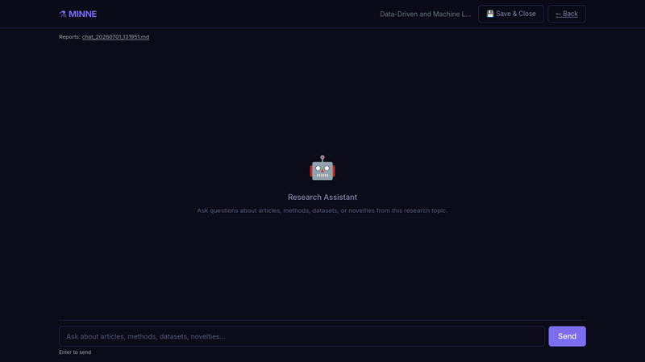
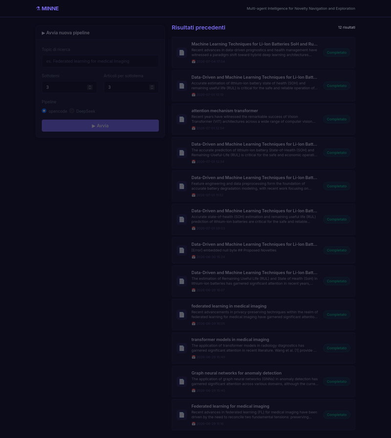
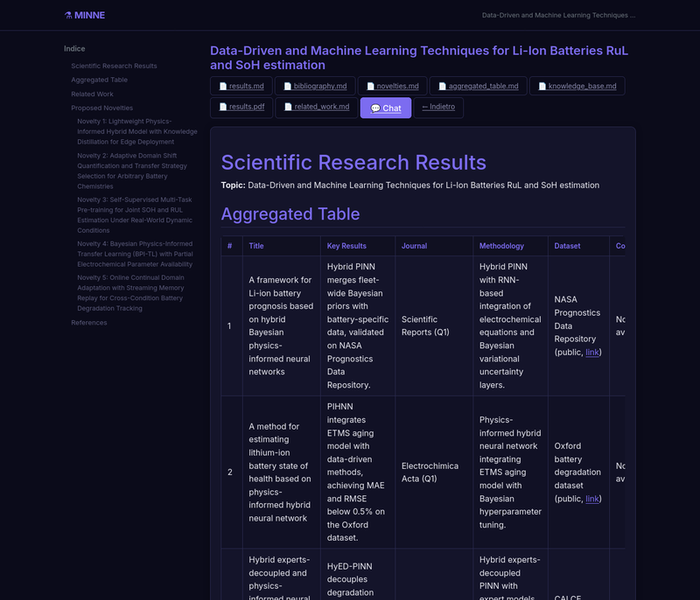

# **M**ulti-agent **I**ntelligence for **N**ovelty **N**avigation and **E**xploration

Orchestrates AI agents via `opencode` (or DeepSeek API directly) to search, verify, and analyze scientific papers from Q1 journals, producing structured Markdown reports, PDFs, and an interactive chatbot knowledge base.

---

## Architecture

```
                    ┌──────────────────────┐
                    │  OrchestratorAgent    │
                    └──────────┬───────────┘
                               │
                    asyncio.gather (parallel)
                    ┌─────┬─────┬─────┬─────┐
                    │     │     │     │     │
               ┌────┘ ┌───┘ ┌───┘ ┌───┘ ┌───┘
               │     │     │     │     │
     ┌─────────▼──┐  │  ┌──▼──────────┐  │
     │ResearchAgent│  │  │ResearchAgent│  │
     │ (LLM/web)   │  │  │ (LLM/web)   │  │
     └──────┬─────┘  │  └──────┬───────┘  │
            │        │         │          │
     ┌──────▼──────┐ │  ┌──────▼────────┐ │
     │CitationVerif│ │  │CitationVerif  │ │
     │(arXiv+DOI)  │ │  │(arXiv+DOI)    │ │
     └──────┬──────┘ │  └──────┬────────┘ │
            │        │         │          │
     ┌──────▼──────┐ │  ┌──────▼────────┐ │
     │SummaryAgent │ │  │SummaryAgent   │ │
     └─────────────┘ │  └───────────────┘ │
               │     │     │     │     │
               └─────┴─────┴─────┴─────┘
                         │
              ┌──────────▼──────────┐
              │   AggregatorAgent   │ → Markdown table
              └──────────┬──────────┘
                         │
              ┌──────────▼──────────────┐
              │ RelatedWorksDraftAgent  │ → narrative draft
              └──────────┬──────────────┘
                         │
              ┌──────────▼──────────┐
              │ NoveltyProposalAgent│ → novelty table
              └──────────┬──────────┘
                         │
              ┌──────────▼──────────┐
              │  BibliographyAgent  │ → IEEE refs
              └─────────────────────┘
```

### Module structure

| File | Purpose |
|------|---------|
| `pipeline.py` | Main entry (opencode subprocess), orchestration + CLI |
| `pipeline_deepseek.py` | Alternative entry using direct DeepSeek API |
| `pipeline_agents.py` | `OpencodeClient`, all 7 agent classes + prompts (opencode variant) |
| `pipeline_deepseek_agents.py` | `DeepSeekClient`, all 7 agent classes + prompts (DeepSeek variant) |
| `pipeline_domain.py` | Shared domain models: `Author`, `Paper`, `Article`, `PipelineResult`, parsers |
| `pipeline_search.py` | Unified search: OpenAlex + Semantic Scholar + arXiv, deduplication, BibTeX generation |
| `pipeline_verifier.py` | Citation verification: arXiv API, Crossref DOI (with DataCite fallback), result types, caching |
| `pipeline_cache.py` | File-based query cache for search results (TTL per source) |
| `pipeline_markdown.py` | Markdown table utilities, wide-table handling, dataset link enrichment |
| `webapp.py` | Flask web interface for launching pipelines and browsing results |

### Agents

| Agent | Role |
|-------|------|
| `OrchestratorAgent` | Decomposes the topic into N distinct subtopics |
| `ResearchAgent` | Finds N recent Q1 articles per subtopic (different journals) via web search |
| `CitationVerifier` | Two-level verification: arXiv API metadata + Crossref DOI/title match (with DataCite fallback) |
| `SummaryAgent` | Structures validated papers into JSON (title, results, journal, methodology, dataset, code) |
| `AggregatorAgent` | Merges all JSON arrays into a Markdown table (with Methodology, Dataset, Code columns) |
| `RelatedWorksDraftAgent` | Writes a narrative state-of-the-art with inline [N] citations |
| `NoveltyProposalAgent` | Proposes 4–5 feasible novelties with difficulty ratings and detailed discussion per novelty |
| `BibliographyAgent` | Formats references in IEEE style |

### Literature search sources

The `pipeline_search.py` module provides programmatic search across three academic APIs, used for citation verification and optional paper discovery:

1. **OpenAlex** — primary search backend (10K requests/day with polite pool), indexes arXiv, PubMed, CrossRef
2. **Semantic Scholar** — fallback, provides citation counts and author metadata
3. **arXiv** — final fallback via direct API

Requests are cached locally in `~/.cache/datapizza/search/` with per-source TTL (24h arXiv, 3d S2/OpenAlex).

### Citation verification

Each paper undergoes verification via `pipeline_verifier.py`:

- **L1 (arXiv)** — resolves the arXiv ID or queries by title with Jaccard word-overlap matching
- **L2 (Crossref)** — resolves the DOI, compares returned title with expected title
- **DataCite fallback** — for arXiv DOIs (10.48550/) not indexed by Crossref
- **Caching** — results cached in `~/.cache/datapizza/verify/` to avoid re-verifying known papers

Verification returns structured `CitationResult` objects with status: `VERIFIED`, `SUSPICIOUS`, `HALLUCINATED`, or `SKIPPED`.

---

## Setup

### Requirements

```bash
pip install flask httpx markdown markdown-pdf arxiv python-dotenv PyMuPDF
```

Create a `.env` file in the project root:

```env
# For opencode pipeline (pipeline.py)
OPENCODE_API_KEY=sk-your-opencode-key-here

# For DeepSeek pipeline (pipeline_deepseek.py)
DEEPSEEK_API_KEY=sk-your-deepseek-key-here
DEEPSEEK_MODEL=deepseek-chat
```

The opencode API key is automatically loaded at startup and injected into `opencode`'s credentials (`~/.local/share/opencode/auth.json`), overriding any saved session.

### Pipeline CLI (opencode)

```bash
python pipeline.py "Research topic" --subtopics 3 --articles 3
```

Arguments:
- `topic` (positional) — research topic string
- `--subtopics` — number of parallel subtopics (default: 3)
- `--articles` — articles per subtopic (default: 3)

Uses `opencode run --agent <name>` for each agent step (agents defined in `pipeline_agents.py`).

### Pipeline CLI (DeepSeek direct)

```bash
python pipeline_deepseek.py "Research topic" --subtopics 3 --articles 3
```

Identical interface but calls the DeepSeek Chat API directly (no opencode dependency). Useful if you already have a DeepSeek API key and want to avoid the opencode subscription. Agents defined in `pipeline_deepseek_agents.py`.

### Webapp

```bash
python webapp.py [port]
# default: http://127.0.0.1:5050
```

Browser interface for:
- Launching the pipeline via form (topic, subtopics, articles)
- Real-time execution status with live log streaming
- Browsing past results (rendered Markdown → HTML)
- Downloading raw files (Markdown, PDF)
- **Chat interface** — interactive Q&A with an AI agent on any completed result, powered by the generated knowledge base


<p align="center">
  
</p>

<!--  -->


---

## Chatbot Interface

Each completed pipeline run generates a `knowledge_base.md` that powers an **interactive chatbot** at `/chat/<topic-slug>`.

### How it works

1. The pipeline produces `knowledge_base.md` containing all articles, summaries, related work, novelties, and bibliography
2. The webapp exposes a chat page where you can ask questions about the research topic
3. The agent answers **only** based on the knowledge base content (no external search)
4. Chat history is kept in `current.json` during the session

<p align="center">
  
</p>

### Save & Enrich

When you close a chat session via the **Save & Close** button:
- A dated chat report is saved to `results/<slug>/chats/chat_YYYYMMDD_HHMMSS.md`
- The Q&A content is **appended to the knowledge base** (`knowledge_base.md`), so future chat sessions benefit from all previous interactions
- The current session is cleared for a fresh start

Saved chat reports are listed on the chat page for later review.

---

## Results

After running a pipeline, the output is saved to `results/<topic-slug>/`:

```
results/<topic-slug>/
├── aggregated_table.md    # summary article table (with Methodology, Dataset, Code columns)
├── related_work.md        # narrative draft with [N] citations
├── novelties.md           # novelty table + detailed discussions (methodology, dataset, baselines, metrics, roadmap)
├── bibliography.md        # IEEE-style references
├── results.md             # unified full report
├── results.pdf            # PDF export (wide tables auto-converted to bullet lists)
├── knowledge_base.md      # chatbot-ready knowledge base with all content
├── proposed/              # intermediate raw article proposals per subtopic
└── chats/                 # saved chat reports (one .md per session)
```

<p align="center">
  
</p>

---

## Agent definitions

Each pipeline variant defines agents in a dedicated Python module, including system prompts and API client logic:

| File | Pipeline | Client |
|------|----------|--------|
| `pipeline_agents.py` | `pipeline.py` (default) | `OpencodeClient` → `opencode run --agent <name>` |
| `pipeline_deepseek_agents.py` | `pipeline_deepseek.py` | `DeepSeekClient` → direct DeepSeek Chat API |

The opencode agents are also defined as `.opencode/agents/*.md` files, which serve as the single source of truth when using `opencode run`:

| File | Agent |
|------|-------|
| `.opencode/agents/orchestrator.md` | Topic decomposition |
| `.opencode/agents/researcher.md` | Q1 journal article search |
| `.opencode/agents/summarizer.md` | Article analysis & JSON output |
| `.opencode/agents/aggregator.md` | JSON consolidation into table |
| `.opencode/agents/related-works-draft.md` | Narrative draft with citations |
| `.opencode/agents/novelty-proposal.md` | Novelty proposals |
| `.opencode/agents/bibliography.md` | IEEE bibliography formatting |

---

## Technical notes

- Shared domain models and utilities live in `pipeline_domain.py`, `pipeline_verifier.py`, `pipeline_search.py`, and `pipeline_markdown.py` — both pipeline variants import from these modules.
- `pipeline.py` runs agents via `opencode run --agent <name>` (opencode subprocess), while `pipeline_deepseek.py` calls the DeepSeek Chat API directly.
- The API key is read from `.env` (`OPENCODE_API_KEY`) and written into `~/.local/share/opencode/auth.json` at startup, overriding any previously saved session credentials.
- `pipeline_search.py` provides programmatic search across OpenAlex, Semantic Scholar, and arXiv with deduplication and local caching.
- `pipeline_verifier.py` uses Jaccard word-overlap title similarity (`title_similarity`) instead of `difflib.SequenceMatcher` for more robust matching.
- Verification supports three statuses: `VERIFIED` (sim ≥ 0.80), `SUSPICIOUS` (0.50 ≤ sim < 0.80), `HALLUCINATED` (sim < 0.50 or not found).
- Parallelism for ResearchAgent → CitationVerifier → SummaryAgent pairs is managed via `asyncio.gather`.
- If no papers pass verification for a subtopic, the pipeline retries with rejection feedback (up to 5 attempts).
- PDF download is attempted via arXiv and full-text is extracted with `PyMuPDF` (fitz); if unavailable, the arXiv abstract is used as fallback.
- **Aggregated table** includes columns for **Methodology**, **Dataset** (with download links for public datasets), and **Code** (with repository links when available).
- **Dataset link enrichment:** After the aggregated table is built, the pipeline automatically detects public datasets missing download URLs and uses web search to find and insert them.
- **PDF wide-table handling:** If the aggregated table has more than 5 columns, it is automatically converted to a per-row bullet list before PDF generation to ensure all columns are readable.
- **Knowledge base generation:** After all pipeline steps, a comprehensive `knowledge_base.md` is built containing topics, subtopics, article corpus, summaries, related work, novelties, and bibliography — ready for the chatbot interface.
- **Chat save enriches KB:** When a chat session is saved, its Q&A is appended to `knowledge_base.md`, so the agent's context grows with every conversation.
- **Novelty proposals** include a summary table plus a detailed discussion section per novelty: methodology, dataset(s) with links, baselines & comparisons, evaluation metrics, and an implementation roadmap with expected challenges and mitigation strategies.
- PDF output requires `markdown-pdf` (optional; skipped if not installed).
- All agents in `.opencode/agents/*.md` use `mode: all`.
- Search results are cached in `~/.cache/datapizza/search/` (TTL per source: 24h arXiv, 3d S2/OpenAlex).
- Verification results are cached in `~/.cache/datapizza/verify/` (TTL: ~1 year, since verified papers don't change).
